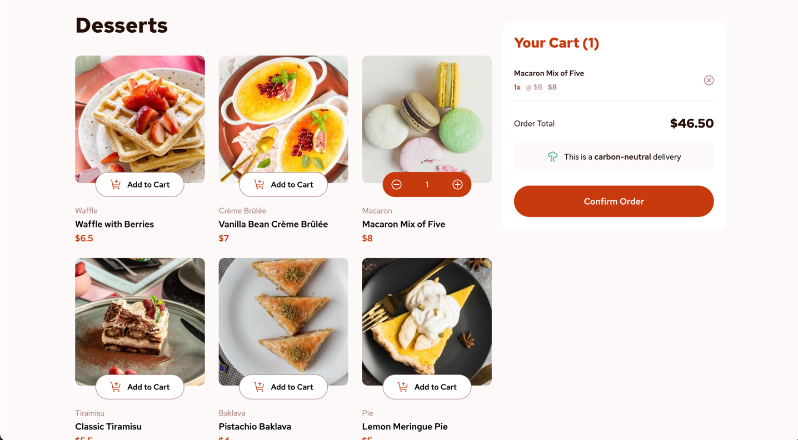

# Frontend Mentor - Product list with cart solution

This is a solution to the [Product list with cart challenge on Frontend Mentor](https://www.frontendmentor.io/challenges/product-list-with-cart-5MmqLVAp_d). Frontend Mentor challenges help you improve your coding skills by building realistic projects.

## Table of contents

- [Overview](#overview)
  - [The challenge](#the-challenge)
  - [Screenshot](#screenshot)
  - [Links](#links)
- [My process](#my-process)
  - [Built with](#built-with)
  - [What I learned](#what-i-learned)
  - [Continued development](#continued-development)
- [Author](#author)

## Overview

### The challenge

Users should be able to:

- Add items to the cart and remove them
- Increase/decrease the number of items in the cart
- See an order confirmation modal when they click "Confirm Order"
- Reset their selections when they click "Start New Order"
- View the optimal layout for the interface depending on their device's screen size
- See hover and focus states for all interactive elements on the page

### Screenshot



### Links

- Solution URL: [https://github.com/EA-Gadgeter/product-card-list-challenge](https://github.com/EA-Gadgeter/product-card-list-challenge)
- Live Site URL: [https://ea-gadgeter.github.io/product-card-list-challenge/](https://ea-gadgeter.github.io/product-card-list-challenge/)

## My process

### Built with

- [Angular 18v](https://v18.angular.dev/)
- CSS/FlexBox - For styles
- Mobile-first workflow

### What I learned

I was taking a 46 hours course on Angular when started the challenge, 
and I decided to use the knowledge I gained to solve this challenge. 
The coolest thing I was learning how to create modal using Angular, its uses a service
to get the HTML reference from de component, so I can open it and close it from anywhere

### Modal Component
```typescript
import { Component, ElementRef, ViewChild, OnInit } from '@angular/core';

import { CartService } from '@/app/cart/services/cart.service';
import { OrderModalService } from '../../services/order-modal.service';

@Component({
  selector: 'order-order-confirmation',
  templateUrl: './order-confirmation.component.html',
  styleUrl: './order-confirmation.component.css'
})
export class OrderConfirmationComponent implements OnInit {
  @ViewChild('orderModal', { static: true })
  dialogElement!: ElementRef<HTMLDialogElement>;

  constructor(
    private orderModalService: OrderModalService,
    private cartService: CartService
  ) {}

  ngOnInit(): void {
    this.orderModalService.dialogElement = this.dialogElement;
  }

  public get cart() {
    return this.cartService.cart;
  }

  public onStartNewOrder() {
    this.orderModalService.closeModal();
    this.cartService.clearCart();
  }
}
```

### Modal Service
```typescript
import {ElementRef, Injectable} from '@angular/core';

@Injectable({
  providedIn: 'root'
})
export class OrderModalService {
  private _dialogElement?: ElementRef<HTMLDialogElement>;

  public set dialogElement (dialogElement: ElementRef<HTMLDialogElement>) {
    this._dialogElement = dialogElement;
  }

  public openModal() {
    this._dialogElement?.nativeElement.showModal();
  }

  public closeModal() {
    this._dialogElement?.nativeElement.close();
  }
}

```

Also using observables to change product carts was good idea

## Continued development

Would like to maker a complex project with angular, using routes, guards, and API, etc.

## Author

- Website - [Emiliano Acevedo](https://ea-gadgeter.github.io/Web-Portafolio/) **quite outdated**
- Frontend Mentor - [@EA-Gadgeter](https://www.frontendmentor.io/profile/EA-Gadgeter)
- LinkedIn - [Emiliano Acevedo](https://www.linkedin.com/in/ariel-emiliano-acevedo-posos-72044a247/?locale=en_US)
